# Food App

Food App is a simple food delivery app developed by using Flutter SDK for browsing food catalogs and
placing orders to restaurants. This app was designed by following MVVM architecture. For
communicating with the backend using GraphQL here we use GraphQL flutter library.

[Try Sample APK](https://drive.google.com/file/d/1wlNr2hzeF_N4oPsdCDBKPcHEbILk4xWf/view?usp=sharing)

### Sample

Splash Screen | Map Screen
-------------|-----------------
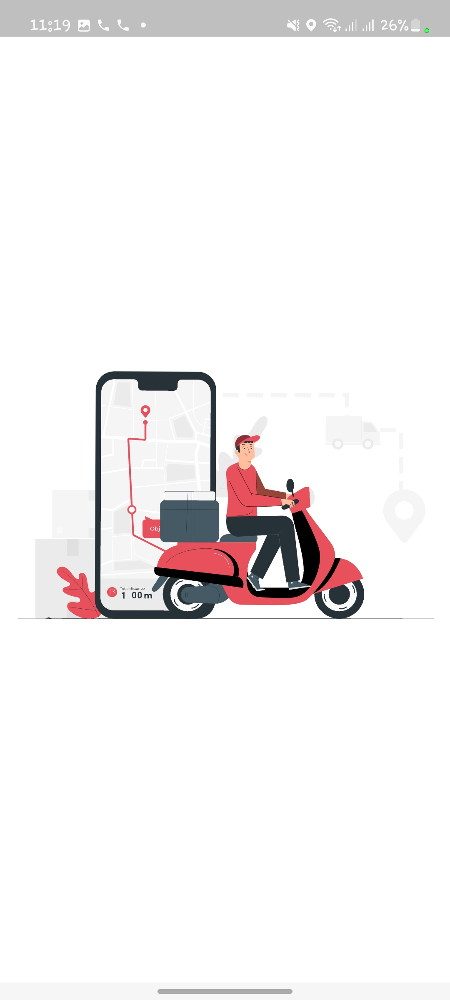 | 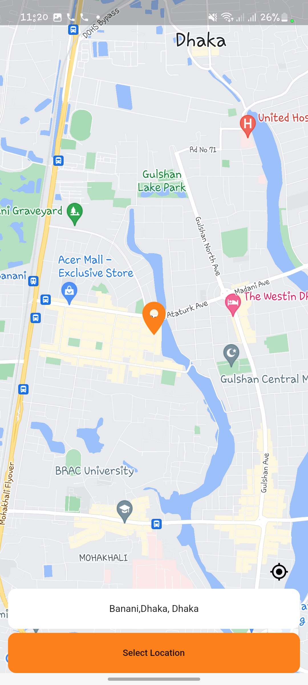

Map Screen (Dark Mode)| Home Screen
-------------|-----------------
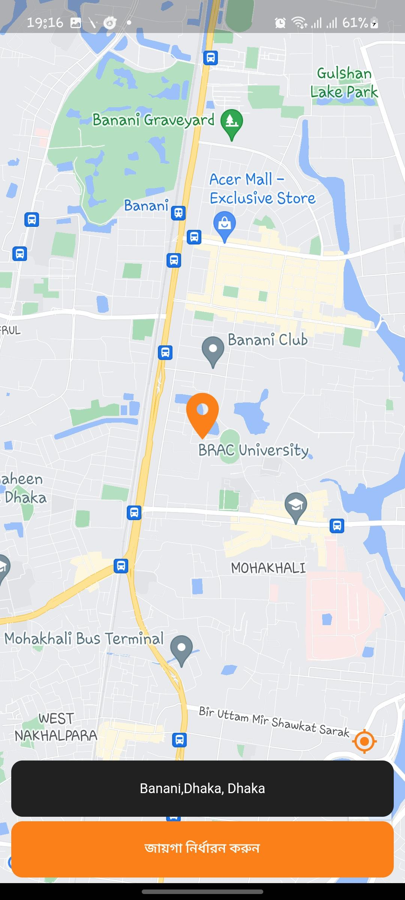 | 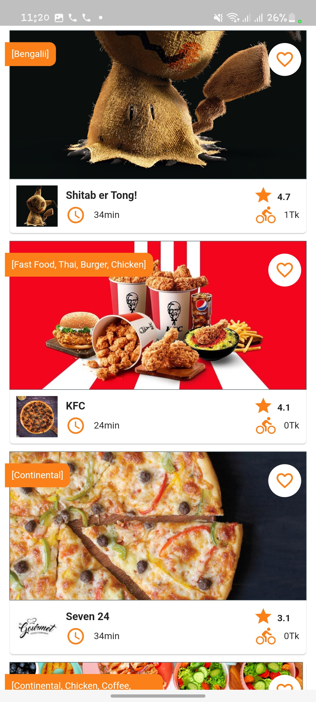

Restaurant/Shop Screen (Dark) | Restaurant/Shop Screen
-------------|-----------------
") | 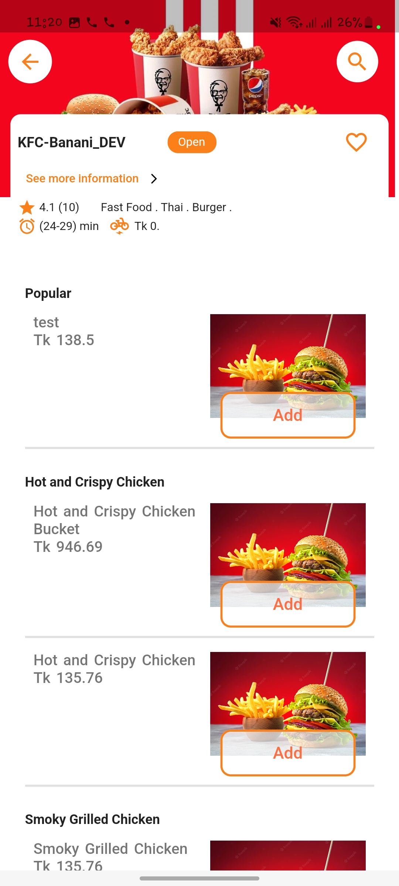

Login Screen | OTP Screen
-------------|-----------------
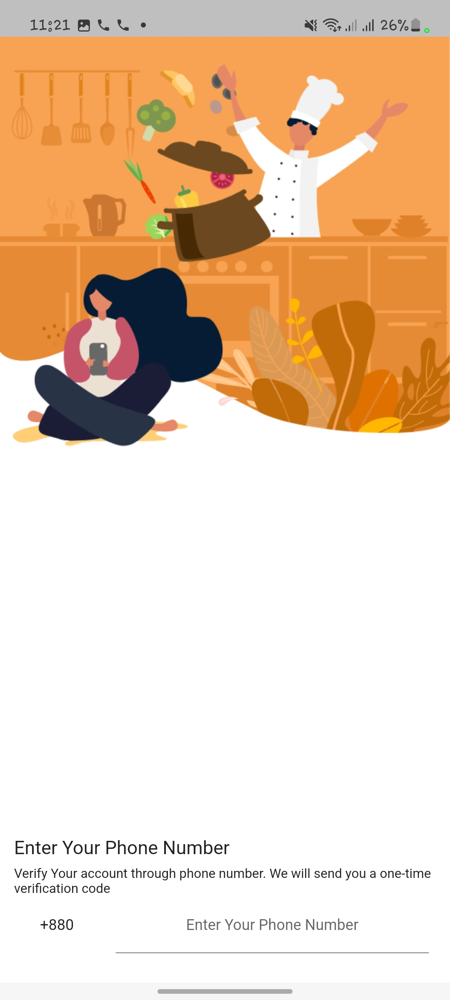 | 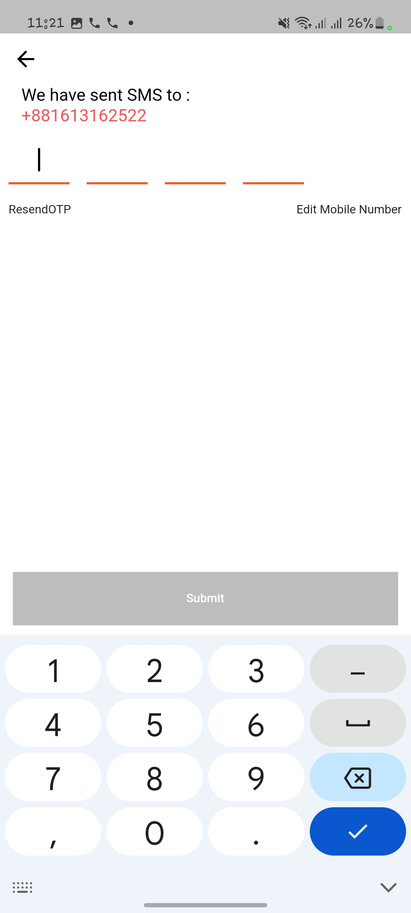

Cart Screen | Checkout Screen
-------------|-----------------
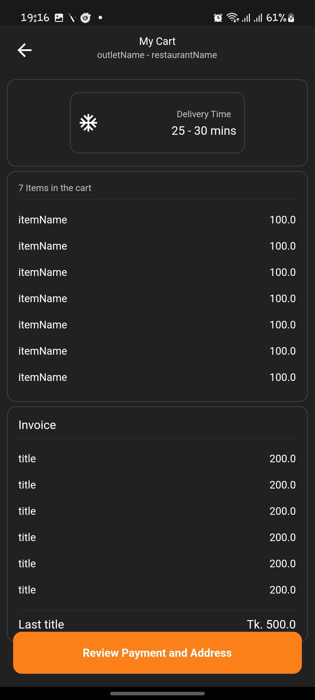 | 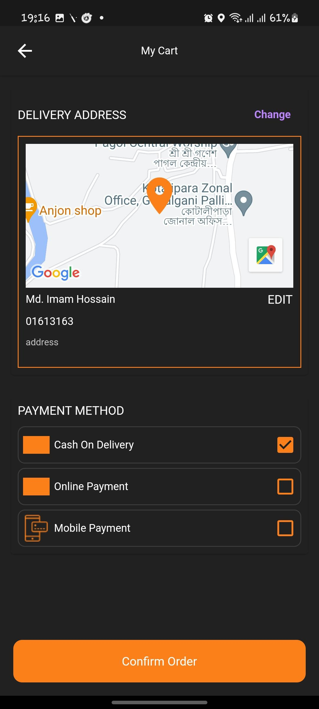

Change Language Screen | Change Theme Screen
-------------|-----------------
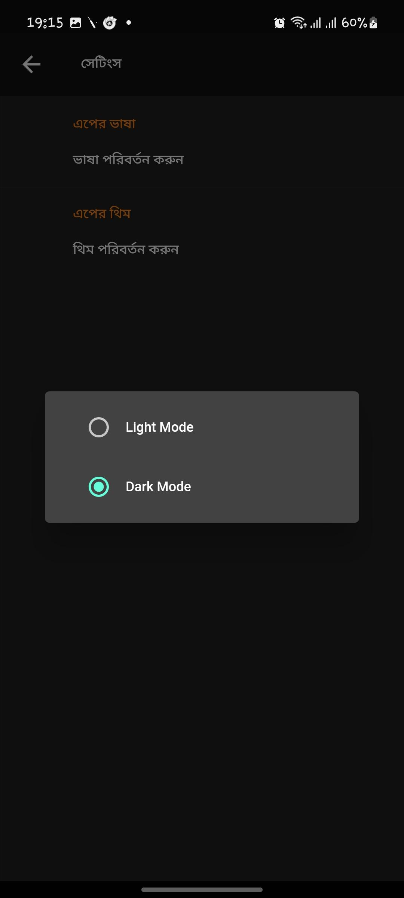 | 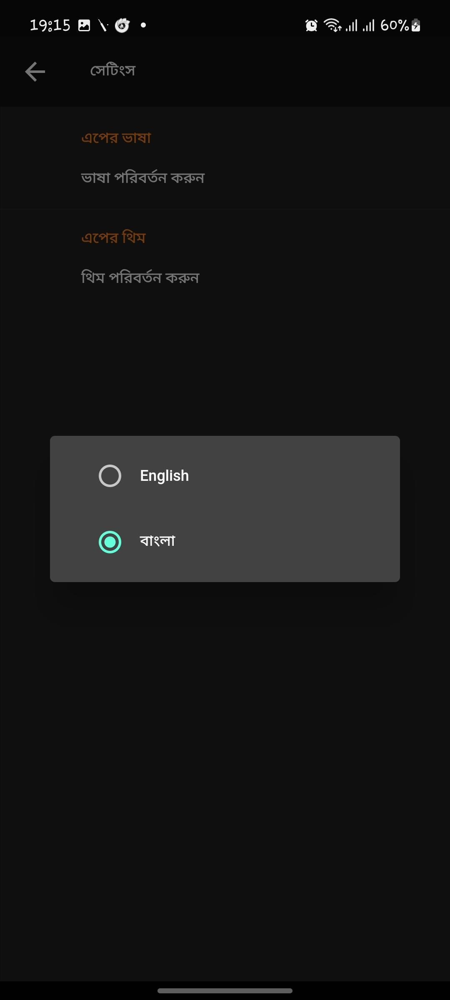

### Features:

* User can select location to browse near by Restaurants/Shops.
* Browse food catalogs of any particular Restaurant/Shop.
* Login using mobile number.
* Add product to cart.
* Placing order to Restaurant/Shop.
* Light and Dark Theme Support.

### Used libraries:

* [Flutter SDK](https://flutter.dev/)
* [Google Maps Flutter](https://pub.dev/packages/google_maps_flutter)
* [Graphql Flutter](https://pub.dev/packages/graphql_flutter)
* [Get](https://pub.dev/packages/get)
* [Get Storage](https://pub.dev/packages/get_storage)

### License

```
Copyright 2022 Md. Imam Hossain

Licensed under the Apache License, Version 2.0 (the "License");
you may not use this file except in compliance with the License.
You may obtain a copy of the License at

   http://www.apache.org/licenses/LICENSE-2.0

Unless required by applicable law or agreed to in writing, software
distributed under the License is distributed on an "AS IS" BASIS,
WITHOUT WARRANTIES OR CONDITIONS OF ANY KIND, either express or implied.
See the License for the specific language governing permissions and
limitations under the License.
